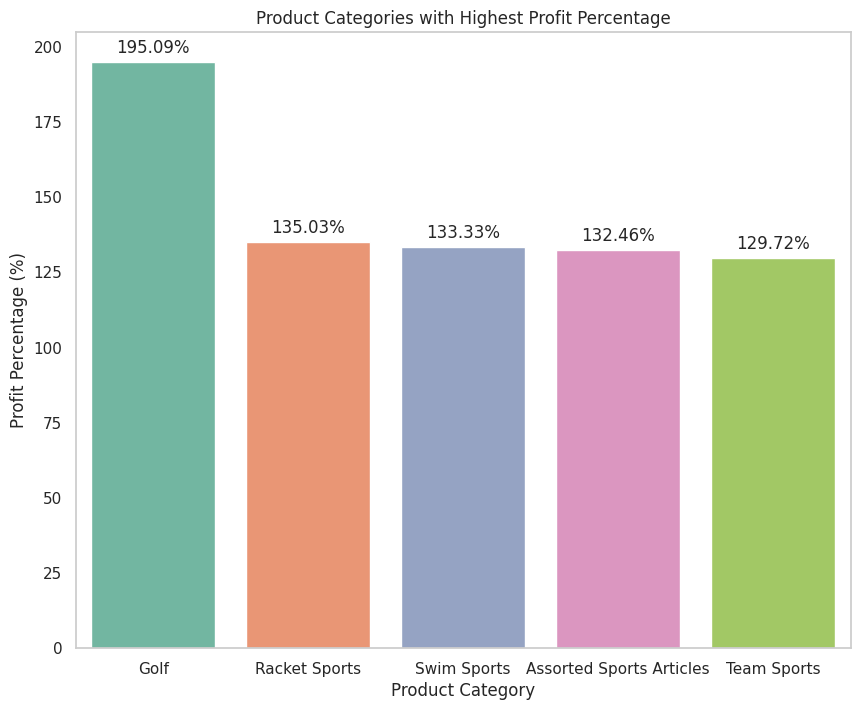
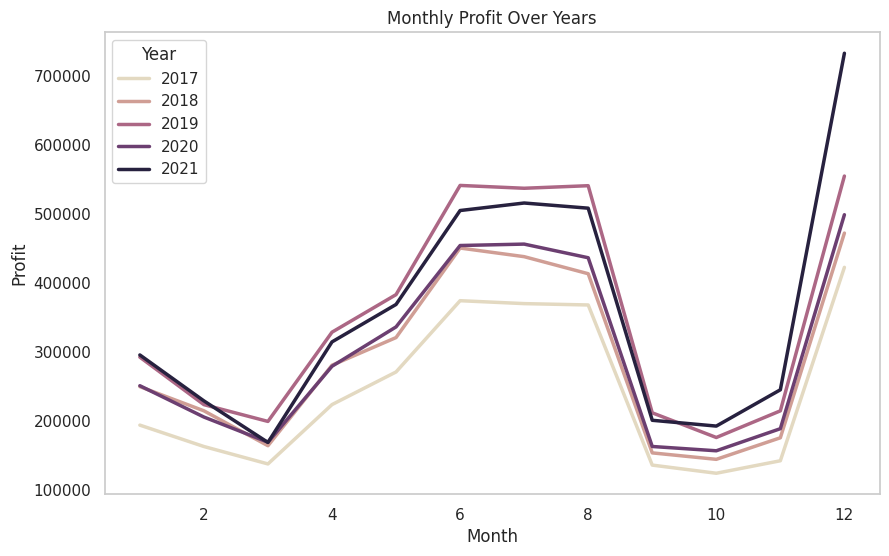
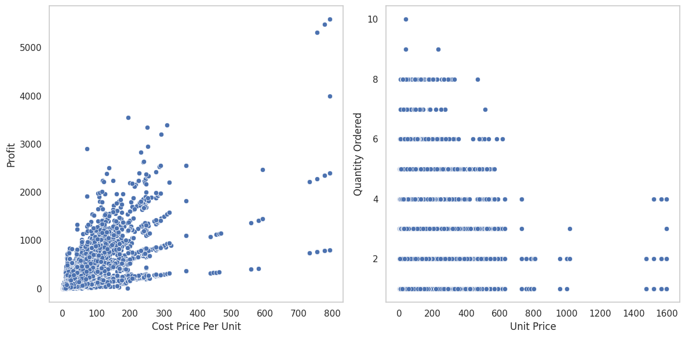
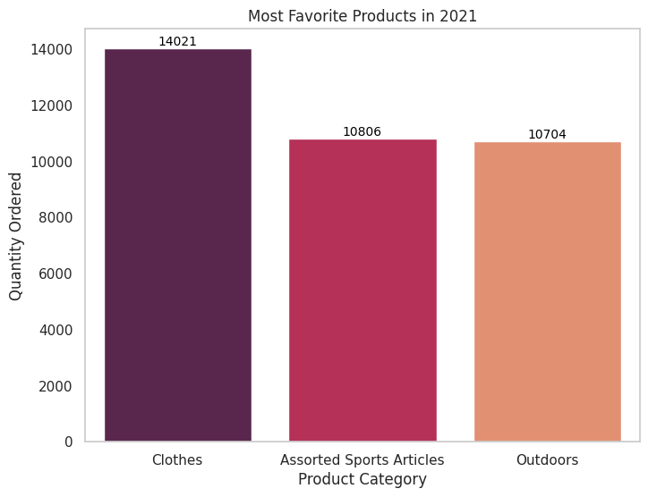
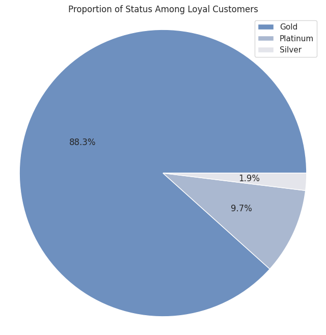

# Online Store Retail Orders Analysis and Visualization

## Overview

This project will analyze and visualize data from [Wholesale & Retail Orders Dataset](https://www.kaggle.com/datasets/gabrielsantello/wholesale-and-retail-orders-dataset?select=product-supplier.csv). The goal is to gain insights and trends that can provide valuable business intelligence and aid decision-making processes.

## Dataset Description

The dataset I used is in [`datasets`](datasets), it comprises two tables: [`orders`](datasets/orders.csv) and [`product supplier`](datasets/product_supplier.csv). These tables can be joined on the `Product ID` column. The joined table is in [`merged_data.csv`](datasets/merged_data.csv).

## Task Descriptions

1. **Data Cleaning**:
    - Remove inconsistencies in `Customer Status`.
    - Drop rows with missing values.
    - Eliminate duplicate entries.

2. **Business Questions**:
    - Identify the product with the highest profit percentage.
    - Analyze the monthly profit trend over the years.
    - Investigate the relationship between cost, profit, and quantity ordered.
    - Determine the top three favorite products in the latest year.
    - Explore the order-to-delivery length tendency and the longest delivery time for each month in the latest year.
    - Identify active loyal customers for a discount promo and analyze their customer status proportion.

## Analysis Approach

- **Data Cleaning**: Addressed inconsistencies, missing values, and duplicates in the dataset to ensure data quality.
- **Data Analysis**: Utilized Python libraries such as Pandas, NumPy, Matplotlib, and Seaborn to perform exploratory data analysis and answer business questions.
- **Visualization**: Employed various visualization techniques, including bar charts, line plots, scatter plots, and pie charts, to visually represent insights and trends within the data.

## Data Cleaning

The data cleaning process involved several key steps to ensure the dataset's accuracy and reliability for analysis:

1. **Loading the Datasets**:\
   Imported the `orders` and `product_supplier` datasets using Pandas.

    ```python
    orders = pd.read_csv("orders.csv")
    product_supplier = pd.read_csv("product_supplier.csv")
    ```

2. **Merging the Datasets**:\
   Combined the `orders` and `product_supplier` datasets on the `Product ID` column using a left join to include all records from the `orders` dataset along with matching records from `product_supplier`.

    ```python
    merged_data = pd.merge(orders, product_supplier, on='Product ID', how='left')
    ```

3. **Removing Inconsistencies in Customer Status**:\
   Standardized the `Customer Status` column by capitalizing the first letter of each status to ensure consistency.

    ```python
    merged_data['Customer Status'] = merged_data['Customer Status'].str.capitalize()
    ```

4. **Handling Missing Values**:\
   Checked for missing values in the dataset and found none, so no further action was necessary.

    ```python
    print(merged_data.isnull().sum())  # Check for missing values
    ```

5. **Eliminating Duplicate Entries**:
   Checked for duplicate entries in the dataset and confirmed there were no duplicates, so no rows needed to be removed.

    ```python
    print(merged_data['Order ID'].value_counts())  # Check for duplicate entries
    ```

These steps ensured that the dataset was clean and ready for the subsequent analysis and visualization tasks. The full corresponding code is available in [`ecommerce_analysis.py`](ecommerce_analysis.py).

## Analysis Results

To answer the business questions, I used the code in [`ecommerce_analysis.py`](ecommerce_analysis.py). From the analysis, we found the following insights:

\
**Golf** has the highest profit percentage at 195.05%. This suggests that Golf-related products have a high markup and generate significant profit relative to their cost price. **Racket Sports**, **Swim Sports**, **Assorted Sports Articles**, and **Team Sports** follow closely, with profit percentages ranging from 129.72% to 135.03%. These categories are also popular among customers.

\
The profit generally shows an increasing trend over the years, continuing until 2019. However, in 2020, the profit dropped, possibly due to external factors such as the COVID-19 pandemic. There are clear seasonal patterns in profit, with higher profits often observed in the middle of the year (around May to July) and a dramatic increase at the end of the year.

\
The visualization suggests that a lower cost price doesn't guarantee higher profits. Customers are more likely to buy larger quantities when the unit price is lower.

\
**Clothes** is the most popular category, with 14,021 units sold in 2021, significantly higher compared to other categories. This suggests that customers have a strong preference for clothing items. Following **Clothes**, we have **Assorted Sports Articles** and **Outdoors**, with 10,806 and 10,704 units ordered respectively.

| Month | Order to Delivery Length (Median) | Longest Order to Delivery Length (Max) |
|-------|-----------------------------------|---------------------------------------|
| 1     | 0.0                               | 20                                    |
| 2     | 0.0                               | 20                                    |
| 3     | 0.0                               | 23                                    |
| 4     | 0.0                               | 19                                    |
| 5     | 0.0                               | 18                                    |
| 6     | 0.0                               | 16                                    |
| 7     | 0.0                               | 21                                    |
| 8     | 0.0                               | 17                                    |
| 9     | 0.0                               | 21                                    |
| 10    | 0.0                               | 22                                    |
| 11    | 0.0                               | 24                                    |
| 12    | 0.0                               | 25                                    |

The pattern is consistent across most months, with the median order-to-delivery length being 0.0 days, meaning most orders were delivered on the same day they were placed. There are occasional delays in delivery in November and December, where the longest order-to-delivery length reached 24 and 25 days. These longer delivery times might be due to increased demand during holiday seasons.

\
From 103 loyal customers, **Gold** status customers make up the majority of active loyal customers, accounting for 88.3% of the total. It would be wise for the owner to focus on giving promotions specifically targeted at this group.
